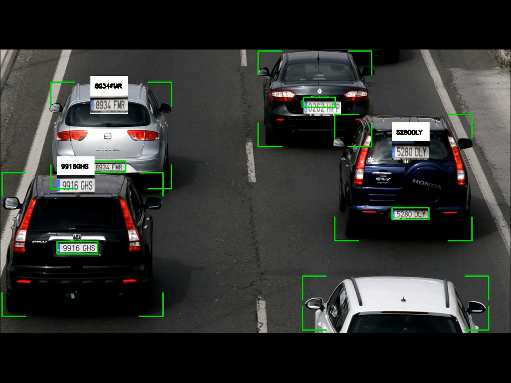
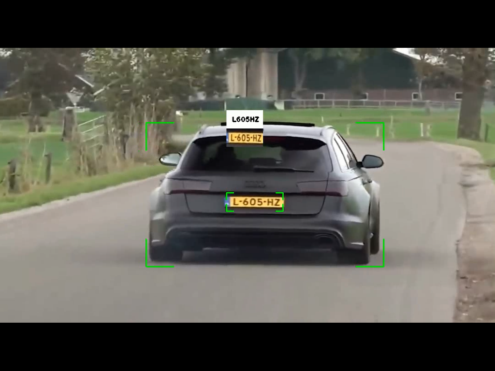

# 🚗 License Plate Detection and Reading System




---

## 📖 Introduction
This project implements a **real-time license plate detection and reading system** using computer vision and deep learning. It detects vehicles and their license plates from video feeds and performs OCR (Optical Character Recognition) to extract the plate numbers. The system utilizes **YOLO (You Only Look Once)** for object detection and **PaddleOCR** for text recognition.

---

## ✨ Features
- 🚙 Real-time vehicle detection
- 🏷️ License plate detection and localization
- 🔤 Optical Character Recognition (OCR) for license plate text extraction
- 🖼️ Visual display of detected plates with:
  - Highlighted license plate regions
  - Extracted plate numbers
  - Cropped and enlarged plate images
- 🎥 Support for video file processing
- 🎨 Clean visualization with custom border drawing

---

## 🛠️ Prerequisites
- Python 3.8 or higher
- Required libraries (can be installed via `requirements.txt`)

---

## ⚙️ Installation
1. Clone the repository:
```bash
git clone <repository-url>
cd <project-directory>
```

2. Install the required dependencies:
```bash
pip install -r requirements.txt
```

3. Download the required model files:
   - Place the license plate detection model in `Models/license_plate_model.pt`
   - Place the vehicle detection model in `Models/yolo11n.pt`

---

## ▶️ Usage
1. Place your input video in the `Testing Resources` directory.

2. Run the main script:
```bash
python Main_code_file.py
```

3. Controls:
   - Press **'q'** to quit the application.

---

## 📂 Output
The system will display:
- Real-time video feed with detected vehicles and license plates
- Bounding boxes around detected vehicles and license plates
- License plate numbers displayed above the detected plates
- Cropped and enlarged views of detected license plates

---

## 🗂️ Project Structure 
```
├── Models/
│   ├── license_plate_model.pt
│   └── yolo11n.pt
├── Testing Resources/
│   └── video 2.mp4
├── Main_code_file.py
├── Output/
│   ├── licence_plate_reading 1.mp4
│   └── licence_plate_reading 2.mp4
├── requirements.txt
└── README.md
```

---

## 🧑‍💻 Technical Details
- **Vehicle Detection:** YOLOv8n model
- **License Plate Detection:** Custom trained YOLO model
- **OCR Engine:** PaddleOCR
- **Image Processing:** OpenCV
- **Video Processing:** 1080x600 resolution

---

## ⚠️ Notes
- The system is optimized for clear, front-facing license plates.
- Performance may vary based on video quality and lighting conditions.
- Ensure sufficient computational resources for real-time processing.

---

## 🙌 Contributors
Project by: **Mudassar Khan**

---

*For any questions or issues, please open an issue on the repository.*

